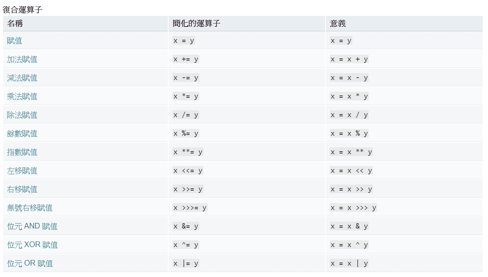

# 如何使用運算子 (Operators)

## 代數運算子

代數運算子用來進行日常的十進位代數運算。包括以下運算子：

- `+`：相加
- `-`：相減
- `*`：相乘
- `/`：相除
- `%`：取餘數

### 範例-代數運算子

```javascript
    consol.log(4 + 3 == 7);  //true
    consol.log(4 - 3 == 1);  //true
    consol.log(4 * 3 == 12); //true
    consol.log(4 / 3 == 1);  //true
    consol.log(4 % 3 == 1);  //true
```

[練習代數運算子](/homework/test1.html)

---

## 遞增和遞減運算子

- `++`

- `--`

### 範例-遞增和遞減運算子

```javascript
    var  n = 3;
    consol.log(++n == 4); //4 == 4,n=4 //true
    consol.log(n++ == 4); //4 == 4,n=5 //true
    consol.log(n == 5); // 5 == 5//true
```

[練習遞增和遞減運算子](/homework/test2.html)

---

## 二元運算子

二元運算子用在二進位數運算。

- `&`：bitwise AND
- `|`：bitwise OR

### 範例-二元運算子

```javascript
    int a = 3;  /* 0000 0011 */
    int b = 5;  /* 0000 0101 */
    /*     0000 0011
        &) 0000 0101
        -------------
           0000 0001  */
    consol.log((a & b) == 1);

    /*     0000 0011
        |) 0000 0101
        -------------
           0000 0111  */
    consol.log((a | b) == 7)
```

[練習二元運算子](/homework/test3.html)

---

## 比較運算子

- ==：相等
- !=：相異
- >：大於
- >=：大於或等於
- <：小於
- <=：小於或等於

***`==`與 `===` 差異***

`===`是比較數值內容(reference value);

`==`是比較變數記憶體位置(reference type)

### 範例-比較運算子

```javascript
    consol.log(4 == 4); //true
    consol.log(4 != 5); //true

    consol.log(5 > 4); //true
    consol.log(5 >= 4); //true

    consol.log(3 < 4); //true
    consol.log(3 <= 4); //true
```

[練習比較運算子](/homework/test4.html)

---

## 指派運算子

指派運算子分為一般指派運算和複合指派運算。

- =：一般賦值
- +=：相加後賦值
- -=：相減後賦值
- *=：相乘後賦值
- /=：相除後賦值
- %=：取餘數後賦值



### 範例-指派運算子

```javascript
    var n = 4;

    n += 3; //n=n+3 //n=7
    consol.log(n == 7)
```

[練習指派運算子](/homework/test5.html)

---

## 流程控制-條件判斷、迴圈

三元(條件)運算子
`condition ? a : b` //條件?值a:值b
如條件為true,則回傳值a；反之則回傳值b(成立就是a，不成立就是b)

### 範例-`if  else`

```javascript
    var age = 20
    var status = (age >= 18)? "成人":"小孩";
    console.log(status) //成人
```

也可以寫成:

```javascript
    var age=20
    if (age >=18) {
    console.log("成人");
    }
    else {console.log("小孩")}
```

[練習if...else](/homework/test6.html)

switch:
當條件很多時可以使用`switch`判斷，記得要在每個case後寫`break`，不然會全部都執行。

### 範例-`switch`

```javascript
    var country = 'Taiwan';
    switch(country) {
    case 'Taiwan':
    console.log('hello' + country);
    break;
    case 'Japan':
    console.log('hello' + country);
    break;
    case 'Korea':
    console.log('hello' + country);
    break;
    default:
    console.log('hello' + country);  
    }
```

[練習switch](/homework/test7.html)

迴圈 for：當你知道程式需要重複執行幾次時可以使用 for 迴圈

### 範例-`for`

```javascript
    var i; //i從1跑到9，每跑一次+1
    for(i = 0; i < 10; i++) { //也可以寫for(var i=0;i<10;i++)
    console.log(i);//i從0~9
    }
```

[練習for](/homework/test8.html)

迴圈while：當你程式不知道需要重複執行幾次時可以使用 while 迴圈

***留意結束條件，以免產生無限迴圈**

### 範例-`while`

```javascript
     var num = 1;sum=10
    while(num <= 10) {
    console.log(sum += num);
    num++;
    }
    //第一圈 num=1 sum=10+1=11 結束時num=2
    //第二圈 num=2 sum=11+2=13 結束時num=3
    //第三圈 num=3 sum=13+3=16 結束時num=4
```

[練習while](/homework/test9.html)

迴圈do...while：當迴圈次數不明確時，可以使用 while，而 do while 為即使false也至少會執行一次。

### 範例-`do...while`

```javascript
    var x = 0;
    while(x < 10) {
    console.log(x);  //0~9
    x++;
    }

    var y = 0;
    do {
    console.log(y);
    y++;
    } while(y < 10); //0~9 //true
```

當條件一樣，只是把 while 迴圈的執行與判斷模式相反過來，do while 與while結果會相同。

```javascript
    var i =0
    do{
    console.lpg(i);
    i--;
    }
    while(i>1); //0
```

[練習do...while](/homework/test9.html)

## 函式 function

函數是一種可以讓一段程式區塊重複使用的程式撰寫方式，在 JavaScript 中函數屬於一級物件（first class object），可以將函數當參數或變數傳遞。

### 範例 function

函數可以傳入參數（如下的 x, y）

```javascript
    function sum(x, y) { //function+function名稱+(參數)
    return x + y;  //{程式碼}
    }

    console.log(sum(20,30)); //50
```

也有可能沒有參數傳入，函數使用 return 回傳值，若沒寫則回傳 undefined，如下範例

```javascript
    function average(){
        return;
    }
    console.log(average());  //undefined
```

在 ES6 簡化了函數的使用出現了箭頭函數（arrow function）：

```javascript
    const plus = (x, y) => {
    return x + y;
    }
    console.log(plus(18,32)) //50
```

***留意functionName是否declared***

[練習函數](/homework/test10.html)

## 物件（object）

是一種儲存資料的資料結構，可以對應成真實世界的物件（有屬性值和方法），一般而言主要有三種建立方式：

- 1.使用 `new Object`

### 範例1

```javascript
var obj = new Object();
```

- 2.使用 `{}`

```javascript
var obj = {
name: 'Mark',
age: 23
}
```

- 3.使用建構函數

## 參考資料

[如何使用運算子 (Operators)](https://michaelchen.tech/c-programming/operator/)

[JavaScript 101 快速入門教學](https://blog.techbridge.cc/2017/01/14/javascript101-tutorial/)

[從ES6開始的Javascript學習生活](https://eyesofkids.gitbooks.io/javascript-start-from-es6/content/part3/loop.html)

[給開發者的網頁技術文件請參考](https://developer.mozilla.org/zh-TW/docs/Web/JavaScript/Guide/Functions)

[JavaScript switch 語法](https://www.fooish.com/javascript/switch-case.html)

[JavaScript Function (函數)](https://www.fooish.com/javascript/function.html)

[JavaScript Switch 语句](https://www.w3school.com.cn/js/js_switch.asp)

[你懂 JavaScript 嗎？#17 物件（Object）](https://cythilya.github.io/2018/10/24/object/)
